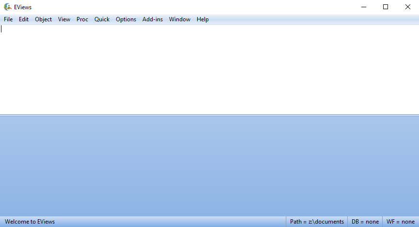

class: section, animated, fadeIn
#Introductions

---
class: animated, fadeIn
##Introductions

 - **Vladimir Pyrlik**, 4th year PhD student at CERGE-EI
 
 - Time Series and Applications, High-dimensional Analysis
 
 - .cross[normally, can be found in **Office 101**] .rmk[ *oh... well...*]
 
 - contact me at [vladimir.pyrlik@cerge-ei.cz](mailto:vladimir.pyrlik@cerge-ei.cz)
 
 - or add up on [fb.com/vladimir.pyrlik](http://fb.com/vladimir.pyrlik)

---
class: animated, fadeIn
##Classes Materials

 - Everything available online
 
 - These slides:
 
 .center[.url[[vpyrlik.github.io/MAE_ATS_ES_Summer2020/20200506.html](http://vpyrlik.github.io/MAE_ATS_ES_Summer2020/20200506.html)]]
 
 .center[]

---
class: section, animated, bounceIn
##Exercise Session 00
#Introduction into EViews

---
class: hands, middle, animated, flipInX

#Is anyone familiar with EViews already?

---
class: animated, fadeIn
##Outline

###1. What is EViews
.rmk[*quick overview, website, license, installation*]

--

###2. The interface overview
.rmk[*user interface overview, data import, basic operations with data*]

--

###3. Recommended resources
.rmk[*documentation, online tutorials and courses*]

---
class: section, animated, bounceIn
# What is EViews

---
class: hands, middle, animated, flipInX
#Have you got your EViews installed already?
###Which version?

---
class: animated, fadeIn
##What is EViews

 - **official EViews page:** [.link[eviews.com]](eviews.com)

*"EViews offers academic researchers, corporations, government agencies, and students access to **powerful** statistical, forecasting, and modeling **tools** through an innovative, **easy-to-use object-oriented interface**."* 

--

 - a 3-minute intro video into what EViews is about .center[.tinyurl[[https://youtu.be/ZXMlDfIDzhk](https://youtu.be/ZXMlDfIDzhk)]] .center[]

---
class: animated, fadeIn
##Versions, license, installation...

 - For our purposes versions **7 and up** are perfectly Ok .right[.rmk[The current latest version is **EViews 11**]]
 
--

 - For student version go to [pricing > student version lite](https://www.eviews.com/EViews11/EViews11Univ/evuniv11.html)
 
 - Why *"lite"*? .rmk[Check out the table on the page above!]
 
--

 - Installation is pretty easy, just follow the instructions.
 
 - Be sure you have access to the folders EViews is about to use
 
 - Student version occasionally requires internet connection (once per several days)

---
class: center, middle, animated, flipInY
###Welcome to EViews!  .rmk[*switching to the actual EViews now...*]

---
class: section, animated, bounceIn
#Recommended Resources

---
class: animated, fadeIn
##EViews documentation

 - Consider the **EViews User's Guide** as a major textbook in econometrics, not only the soft itself

--

 - Whatever can be done with data in EViews has a corresponding section in the documentation
 
--
 
 - The documentation covers not only the technicalities of the soft usage, but also econometrics theory, including references to the books and other literature

--

 - let's see some examples in .rmk[Help > EViews Help Topics] .bb[F1]
 
---
class: animated, fadeIn
##Some online resources

 - [Official online EViews tutorials (slides)](http://www.eviews.com/Learning/index.html) .rmk[Help > Online Tutorials]

--

 - many online courses, e.g., [edX & IMF Macroec Forecasting](https://www.edx.org/course/macroeconometric-forecasting-2)

 - [EViews videos from this course are available on Youtube](https://www.youtube.com/playlist?list=PLUmHBswQv2jyYf07MMjgpr-fvR2UysOH2)

.center[ ]

--

 - other multiple online tutorials, [e.g., this one](https://youtu.be/ME7tqEFyyhQ)

---
class: section, animated, bounceIn
#See you in a week!
##Thank you!