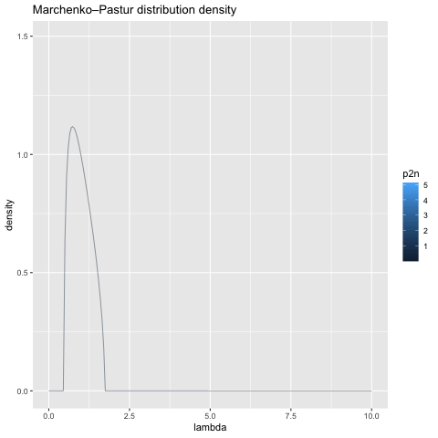

class: animated, fadeIn

###Hi! Thanks for watching :) 

This presentation is an R-markdown based html-document, created in [Xaringan](https://slides.yihui.org/xaringan/).

- The web version is available at .url[https://vpyrlik.github.io/erg1511/slides.html]

.rb[NB!] .rmk[Before viewing the slides, give it some time to load, o.w. some elements (math!) won't look nice. If it happened, reload the page and wait a bit.]

- The pdf version is available at .url[https://vpyrlik.github.io/erg1511/slides.pdf]

- The animated picture from slide 10 is available at .url[https://vpyrlik.github.io/erg1511/stuff/mpd.gif]

- Questions? Feel free to email me **vladimir.pyrlik@cerge-ei.cz**
---
class: animated, fadeIn

#Outline

##1. Setup

###Covariance matrix estimation problem. What is "Large"?

##2. Shrinkage: Statistics vs RMT

###Two alternative views of shrinkage & and how they relate to each other

##3. Recent Shrinkage Estimators

###Optimal linear & nonlinear shrinkage

---
class: section, animated, bounceIn

#Setup

 

###Covariance matrix estimation problem

##What is "Large"?

---
class: animated, fadeIn

#Large covariance matrix estimation problem

Assume $x=(x_{1},...x_{p}),\;\mathbb{E}x=\mathbb{O}_p,\;\mathbb{E}[x'x]=\Sigma\;\text{p.d.}$

--

The problem then is to estimate $\Sigma$, given data $\{X_i\}_{i=1,...n}\sim\text{iid}$.

--

 

$S_n\equiv n^{-1}X'X$ performs well, when "*p* is small".

--

For "large *p*", $S_n$ is neither consistent, nor well-conditioned.

--

 

**Large *p* ** assumes $p\ge n$, normally even $p>>n$.

---
class: section, animated, bounceIn

#Statistical way of shrinkage

---
class: animated, fadeIn

#Bring some structure into $S_n$

$$S_n^*=\rho_1D+\rho_2S_n$$

###The idea
Deviate from $S_n$ to $D$ s.t. $S_n^*$ is close to $\Sigma$ & well conditioned.

--

 

###Alternative versions

- **Choice of $D$**: identity, equicorrelated estimate of $\Sigma$, etc.

--

- **Approaches to choose $\rho$s**: heuristically, relate to $p/n$, *optimize*

---
class: section, animated, bounceIn

#Random Matrix Theory Approach

---
class: animated, fadeIn

#Marchenko-Pastur Law

To the same setup, $X_i\sim\text{iid},\mathbb{E}X_i=\mathbb{O}_p,\mathbb{E}[X_i'X_i]=\Sigma$, add that

- $\{\lambda_1,...\lambda_p\}$ are $\Sigma$'s eigenvalues

- $\{l_1,...l_p\}$ are the eigenvalues of $S_n$, given $p,n$

--

- **general asymptotics setup**: $p\to\infty,n\to\infty,\frac{p}{n}\to c\in(0,\infty)/\{1,\infty\}$.

--

 

The limiting distribution of $l$s is **Marchenko-Pastur distribution**

---
class: animated, zoomInLeft, center, middle

---
class: animated, fadeIn 

#Eigenvalues of large $S_n$ vs $\Sigma$

- The distributions of $\lambda$s, $l$s and the limiting MPD share the same **grand mean**

--

- Given particular $p,n,\;p>n$, sample distribution of $l$s is "overdispersed"

--

- The smaller e.v. are biased downwards, and the larger e.v. are biased upwards

--

 

- The limiting distribution of $l$s is "overdispersed", too.

- But it can be used to estimate the "range" of the population e.v.

---
class: animated, zoomInLeft 

---
class: animated, fadeIn

#Eigenvalues shrinkage

###The idea

If we "knew" the limiting MPD of $l$s, we could use it to shrink the sample $l$s towards $\lambda$s.

--

Assume, such shrunk $l$s are available: $$l^*=\rho_1\mu+\rho_2l.$$

--

Then, given $S_n=\Gamma_n\text{diag}\{l_i\}_{i=1,...p}\Gamma_n'$, we can change $S_n$ to $$S^*=\Gamma_n\text{diag}\{l_i^*\}_{i=1,...p}\Gamma_n',$$ that is potentially a better estimate of $\Sigma$.

---
class: animated, fadeIn

#Structural & RMT Shrinkage

###Structural shrinkage:

$$S_n^*=\rho_1D+\rho_2S_n$$

###RMT Shrinkage:

$$S^*=\Gamma_n\text{diag}\{\rho_1\mu+\rho_2l_i\}_{i=1,...p}\Gamma_n'$$

--

 

.center[

Set $D=I_p$, and $\rho_{1,2}$ independent of $l$s, **these are equivalent**.

]

.center[

###Constant shrinkage intensity estimator

]

---
class: section, animated, bounceIn

##"Honey, I shrunk the sample covariance matrix"

###The optimal linear shrinkage estimator of Ledoit & Wolf (2004)

    

.left[.rmk[Ledoit, O., & Wolf, M. (2004). Honey, I shrunk the sample covariance matrix. The Journal of Portfolio Management, 30(4), 110-119.]]

.left[.rmk[Ledoit, O., & Wolf, M. (2004). A well-conditioned estimator for large-dimensional covariance matrices. Journal of multivariate analysis, 88(2), 365-411.]]

---
class: animated, fadeIn

#Optimal Linear Shrinkage

*Optimal linear shrnkage* of Ledoit & Wolf (2004) is a *constant shrinkage intensity estimator* $S^{**}$ such that $$S^{**}=\text{argmin}_{S^*(\rho_1,\rho_2)=\rho_1I_p+\rho_2S_n}||\Sigma-S^*(\rho_1,\rho_2)||^2.$$

--

###The idea

Since the distribution of the sample eigenvalues is overdispersed around the population eigenvalues distribution, let's relate this overdispersion to the difference between the population and sample covariance matrices to estimate the optimal shrinkage.

---
class: animated, fadeIn

#Optimal Linear Shrinkage

###Eigenvalues overdispersion

$$p^{-1}\mathbb{E}\left[\sum_{i=1}^p(\lambda_i-l_i)^2\right]=p^{-1}\sum_{i=1}^p(\lambda_i-\mu)^2+\mathbb{E}||S_n-\Sigma||^2.$$

--

###The resulting estimator

$$S_n^{**}=\frac{b_n^2}{d_n^2}m_nI_p+\frac{d_n^2-b_n^2}{d_n^2}S_n$$

.center[

### is asymptotically optimal in terms of Frobenius error and consistent under general asymptotics

]

---
class: animated, fadeIn

#Towards nonlinear shrinkage

###Undershrinkage

The optimal linear shrinkage estimator is optimal, but it's linear.

--

*Observation:* it might produce "undershrinkage".

--

 

**Potential improvement**: make $l^{**}(l)$ a nonlinear function.

--

Particularly, relate *shrinkage intensity* to the sample eigenvalues:

$$l_i^{**}(l_i)=\rho_1(l_i)\mu+\rho_2(l_i)l_i.$$

---
class: section, animated, bounceIn

##Nonlinear shrinkage estimation

###Oracle estimator of Ledoit & Péché (2011) and

###Optimal nonlinear shrinkage of Ledoit & Wolf (2012)

 

.left[.rmk[Ledoit, O., & Péché, S. (2011). Eigenvectors of some large sample covariance matrix ensembles. Probability Theory and Related Fields, 151(1-2), 233-264.]]

.left[.rmk[Ledoit, O., & Wolf, M. (2012). Nonlinear shrinkage estimation of large-dimensional covariance matrices. The Annals of Statistics, 40(2), 1024-1060.]]

.left[.rmk[Ledoit, O., & Wolf, M. (2017). Numerical implementation of the QuEST function. Computational Statistics & Data Analysis, 115, 199-223.]]

---
class: section, animated, bounceIn

##Do we still have time?

###Or energy?

---
class: section, animated, fadeIn

#Optimal Linear Shrinkage

###derivation notes

---
class: animated, fadeIn

#OLSh: the setup

- $\{X_i\}_{i=1,...n}\sim\text{iid}(\mathbb{O}_p,\Sigma)$

- $S_n\equiv n^{-1}X'X$

- $S(\rho,\nu)\equiv\underbrace{\rho\nu}_{=\rho_1} I_p+\underbrace{(1-\rho)}_{=\rho_2}S_n$

--

- **the optimization problem**: $$(\hat{\rho},\hat{\nu})=\text{arg}\min_{\rho,\nu}\mathbb{E}\left[||S(\rho,\nu)-\Sigma||^2\right],$$

--

$$\Sigma^*\equiv S(\hat{\rho},\hat{\nu}).$$

---
class: animated, fadeIn

#OLSh: the infeasible estimator

- **the solution to the optimization problem**:

$$\Sigma^*=\frac{\beta^2}{\delta^2}\mu I_p+\frac{\alpha^2}{\delta^2}S_n,$$

--

- where:

$$\mu=p^{-1}\text{trace}(\Sigma),\;\alpha^2=||\Sigma-\mu I_p||^2,\;\beta^2=\mathbb{E}\left[||S_n-\Sigma||^2\right],$$

$$\delta^2=\alpha^2+\beta^2=\mathbb{E}\left[||S_n-\mu I_p||^2\right].$$

--

.center[

###the resulting estimator $\Sigma^*$ is infeasible

]

--

.center[

###but it can be estimated :D

]

---
class: animated, fadeIn

#OLSh: the infeasible estimator

###derivation sketch

$$\mathbb{E}\left[||S(\rho,\nu)-\Sigma||^2\right]=\mathbb{E}\left[||\rho\nu I_p+(1-\rho)S_n-\Sigma||^2\right]=\:...$$

$$...\:=\rho^2||\Sigma-\nu I_p||^2+(1-\rho)^2\mathbb{E}\left[||S_n-\Sigma||^2\right]$$

--

- the first term spits out $\hat{\nu}$:

$$||\Sigma-\nu I_p||^2=||\Sigma||^2-2\nu\text{trace}(\Sigma)+\nu^2,$$

$$\hat{\nu}=p^{-1}\text{trace}(\Sigma)\equiv\mu.$$

--

- then $\hat{\rho}=\frac{\mathbb{E}\left[||S_n-\Sigma||^2\right]}{\mathbb{E}\left[||S_n-\mu I_p||^2\right]}=\frac{\beta^2}{\delta^2}\;\;-\;$**shrinkage intensity**

---
class: animated, fadeIn

#OLSh: why eigenvalues?

### shifting to eigenvalues 

- $\mu=p^{-1}\sum_{i=1}^p\lambda_i=\mathbb{E}\left[p^{-1}\sum_{i=1}^pl_i\right]$

--

- then $\alpha^2+\beta^2=\delta^2$ becomes

.center[

$p^{-1}\mathbb{E}\left[\sum_{i=1}^p(l_i-\mu)^2\right]=p^{-1}\sum_{i=1}^p(\lambda_i-\mu)^2+\mathbb{E}\left[||S_n-\Sigma||^2\right]$

]

--

- and the eigenvalues of $\Sigma^*$ are $\lambda_i^*=\frac{\beta^2}{\delta^2}\mu+\frac{\alpha^2}{\delta^2}l_i$.

--

.center[

###this guarantees that $\Sigma^*$ is p.d.

]

---
class: animated, fadeIn

#OLSh: feasible & asymptotically optimal estimator

###the idea

Find sample analogs of $\mu,\;\alpha,\;\beta$ s.t. under *general asymptotics* the properties of the feasible estimator are the same as of $\Sigma^*$.

--

###the solution

- $m_n\equiv\text{trace}(S_n)$

- $d_n\equiv ||S_n-m_nI_p||^2$

--

- $\bar{b}_n\equiv n^{-2}\sum_{k=1}^n||X_k'X_k-S_n||^2$, and $b_n\equiv\min(\bar{b}_n,d_n)$

--

- $a_n\equiv d_n-b_n$.

---
class: section, animated, bounceIn

##Thank you!